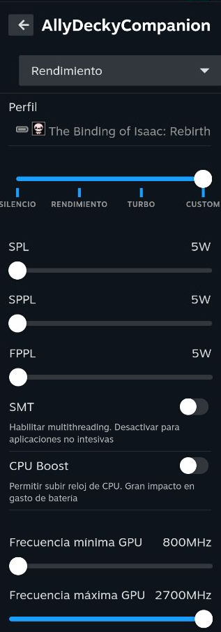
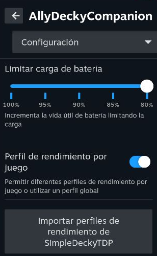

# AllyDeckyCompanion

[](https://github.com/Emiliopg91/AllyDeckyCompanion/actions/workflows/release.yml)
[](https://github.com/Emiliopg91/AllyDeckyCompanion/releases)

- [Features](#features)

- [Requirements](#requirements)

- [Installation](#install)

- [Prerequisites](#prerequisites)

- [Quick Install / Update](#quick-install--update)

- [Manual Install](#manual-install)

- [Uninstall Instructions](#uninstall-instructions)

- [Attribution](#attribution)






## Features

- [x] Per-game performance profiles when playing on AC or battery

- [x] Custom TDP limit by settings SPL, SPPL and FPPL

- [x] SMT control

- [x] CPU Boost control

- [x] GPU frequency control

- [x] CPU and TDP boost on suspend-resume events

- [x] Battery charge limit to 80% to expand battery lifespan

- [x] Check if SimpleDeckyTDP is enabled. Now you can disable it and import it's configuration

- [x] Support for "secure boot"

- [x] Check for BIOS updates

## Compatibility

Tested on Bazzite 3.7.0.

# Install

### Prerequisites

Decky Loader must already be installed.

For early versions, secure boot must be disabled.

### Quick Install / Update

Run the following in terminal, then reboot. Note that this works both for installing or updating the plugin

```


curl -L https://github.com/Emiliopg91/AllyDeckyCompanion/raw/main/install.sh | sh


```

### Manual Install

Download the latest release from the [releases page](https://github.com/Emiliopg91/AllyDeckyCompanion/releases)

Unzip the `tar.gz` file, and move the `AllyDeckyCompanion` folder to your `$HOME/homebrew/plugins` directory

then run:

```


sudo systemctl restart plugin_loader.service


```

then reboot your machine.

### Uninstall Instructions

In Desktop mode, run the following in terminal:

```bash


sudo  rm  -rf  $HOME/homebrew/plugins/AllyDeckyCompanion


sudo  systemctl  restart  plugin_loader.service


```

# Attribution

Thanks to the following for making this plugin possible:

- [SimpleDeckyTDP](https://github.com/aarron-lee/SimpleDeckyTDP)

- [hhd-adjustor](https://github.com/hhd-dev/adjustor/)

- [decky loader](https://github.com/SteamDeckHomebrew/decky-loader/)
